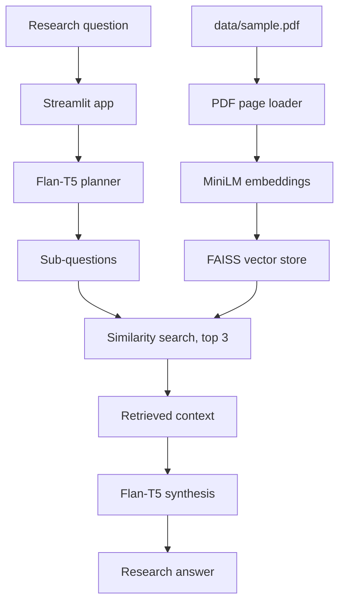

# Autonomous Research Agent (RAG-Based)

An experimental, local research assistant that uses retrieval-augmented generation (RAG) to answer questions about a reference PDF. The application is intended for document-grounded research: instead of asking a language model to answer from general memory, it retrieves relevant passages from the supplied document and gives those passages to a synthesis step.

## Problem Being Solved

Researching a technical topic from long documents is often slow and repetitive. A user may need to search through many pages, identify the sections relevant to a question, compare information from several parts of the document, and then write a concise answer. A general-purpose language model can make this faster, but it may rely on unsupported prior knowledge, miss important passages, or produce answers that cannot be traced back to the source.

This project targets the following problem:

> How can a user ask a natural-language research question and receive a useful answer grounded in the contents of a selected document?

The target use cases include studying research papers, reviewing technical documentation, exploring reports, and creating an initial research brief from a PDF. The system is designed for local, private experimentation with the source document rather than unrestricted web research.

## Proposed Solution

The project solves this problem with a multi-step RAG pipeline:

1. **Understand the question:** a planner converts the broad question into smaller research sub-questions.
2. **Find evidence:** an embedding model represents PDF pages as vectors, and FAISS finds pages semantically related to each sub-question.
3. **Generate an answer:** a local Flan-T5 model receives the retrieved passages and writes a structured response.
4. **Keep the workflow local:** the PDF and model inference are handled locally, avoiding a required external LLM API for the prototype.

RAG is useful here because the model is given relevant source text at answer time. This reduces dependence on memorized knowledge, although it does not by itself guarantee that every answer is correct.

## What It Does

The project targets a simple research workflow:

1. Accept a research question through a Streamlit web interface.
2. Break the question into smaller sub-questions with `google/flan-t5-base`.
3. Load a local PDF and create sentence embeddings for its pages.
4. Search the FAISS vector index for the three most relevant documents for each sub-question.
5. Combine the retrieved text and ask the same local language model to produce a structured answer.

The current implementation is document-focused rather than web-connected. It does not crawl the internet or call a hosted LLM API.

## How It Works



### Main components

- `app.py` is the Streamlit entry point. It builds the local text-generation pipeline, loads the PDF, runs planning and retrieval, and displays the answer.
- `agents/planner_agent.py` creates a LangChain chain that turns one query into newline-separated sub-questions.
- `agents/research_agent.py` performs FAISS similarity search and concatenates the retrieved page content.
- `agents/synthesis_agent.py` creates the LangChain chain that turns retrieved context into the final answer.
- `rag/loader.py` loads PDF pages with `PyPDFLoader`.
- `rag/embeddings.py` uses `sentence-transformers/all-MiniLM-L6-v2` through `HuggingFaceEmbeddings`.
- `rag/vector_store.py` creates an in-memory FAISS index from the loaded pages.

## Requirements

- Python 3.10 or newer
- A local Python environment with enough disk space for PyTorch and the Hugging Face models
- A readable PDF at `data/sample.pdf`

The `data/` directory is empty in the repository. Add a PDF and name it `sample.pdf`, or update the path in `app.py`.

## Setup on Windows

From the repository root, create and activate a virtual environment:

```powershell
py -3.13 -m venv .\venv
.\venv\Scripts\Activate.ps1
```

Install dependencies using the active interpreter:

```powershell
python -m pip install -r .\requirements.txt
```

Using `python -m pip` avoids broken `pip.exe` launcher paths when a virtual environment has been moved or copied. The filename is `requirements.txt`.

## Run the Application

```powershell
streamlit run .\app.py
```

Then open the local URL printed by Streamlit, enter a question, and wait for the first-run downloads and local model inference to complete.

You can also use the venv explicitly if activation is not working:

```powershell
.\venv\Scripts\python.exe -m pip install -r .\requirements.txt
.\venv\Scripts\python.exe -m streamlit run .\app.py
```

## Project Layout

```text
.
├── app.py
├── requirements.txt
├── agents/
│   ├── planner_agent.py
│   ├── research_agent.py
│   └── synthesis_agent.py
├── rag/
│   ├── embeddings.py
│   ├── loader.py
│   └── vector_store.py
└── data/
	└── sample.pdf   # add this file locally
```

## Current Limitations

- The PDF path is hard-coded to `data/sample.pdf`; there is no file-upload control yet.
- The FAISS index is rebuilt every time a question is submitted, which can be slow for large PDFs.
- Retrieved passages are concatenated without page citations, source labels, or deduplication.
- The planner output is split on newline characters, so unusual model formatting may affect retrieval.
- The models run locally and are downloaded from Hugging Face on first use; response time and memory usage depend on the machine.
- The project currently provides a prototype pipeline, not source verification or guaranteed factual accuracy.

## How to Proceed

### Run the current prototype

1. Place a research PDF at `data/sample.pdf`.
2. Create the virtual environment and install `requirements.txt` using the setup steps above.
3. Start the application with `streamlit run .\app.py`.
4. Enter a question that can be answered from the supplied PDF.
5. Review the generated answer against the original document before using it as research output.

### Recommended development path

The next improvements should strengthen reliability and usability in this order:

1. Add a Streamlit PDF upload control instead of requiring the fixed `data/sample.pdf` path.
2. Split documents into smaller overlapping chunks and preserve page metadata for more precise retrieval.
3. Cache embeddings and the FAISS index so they are not rebuilt for every question.
4. Add citations showing the source page for each retrieved passage.
5. Improve prompt instructions so the synthesizer separates evidence from interpretation and says when the document does not contain enough information.
6. Add validation tests for PDF loading, retrieval results, planner output, and synthesis behavior.
7. Add optional web or multi-document research only after document-grounded answers and source attribution are reliable.

The intended progression is therefore: **single PDF prototype -> reliable cited document assistant -> multi-document research assistant -> optional web research agent**.
